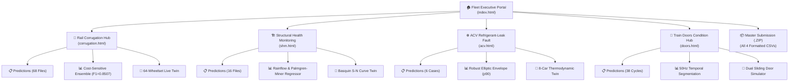

# 🚆 NebulaX 2026 — Unified Condition Monitoring & Digital Twin Platform
### Problem Statement 3: Advanced Condition Monitoring for Rolling Stock & Rail Infrastructure

[](https://nebula-rail-twin-515716532383.asia-southeast1.run.app/corrugation.html)
[](https://www.python.org/)
[](https://scikit-learn.org/)
[](LICENSE)

---

## 🌐 Live Production Deployment
- **Executive Fleet Portal**: [https://nebula-rail-twin-515716532383.asia-southeast1.run.app/index.html](https://nebula-rail-twin-515716532383.asia-southeast1.run.app/index.html)
- **Rail Corrugation Subsystem**: [https://nebula-rail-twin-515716532383.asia-southeast1.run.app/corrugation.html](https://nebula-rail-twin-515716532383.asia-southeast1.run.app/corrugation.html)
- **Structural Health Monitoring (SHM)**: [https://nebula-rail-twin-515716532383.asia-southeast1.run.app/shm.html](https://nebula-rail-twin-515716532383.asia-southeast1.run.app/shm.html)
- **ACV Refrigerant-Leak Localization**: [https://nebula-rail-twin-515716532383.asia-southeast1.run.app/acv.html](https://nebula-rail-twin-515716532383.asia-southeast1.run.app/acv.html)
- **Train Doors Subsystem**: [https://nebula-rail-twin-515716532383.asia-southeast1.run.app/doors.html](https://nebula-rail-twin-515716532383.asia-southeast1.run.app/doors.html)

---

## 👥 Contributors & Collaborators

We would like to acknowledge the core team and collaborators who contributed to the development, analysis, modeling, and deployment of this project:

| Name | GitHub / Role | Contact | Contribution Area |
|---|---|---|---|
| **Vignesh Raj** | [@Vikidaman](https://github.com/Vikidaman) | `kannanvigneshraj@gmail.com` | Lead Developer & Architecture, GCP Cloud Run Deployment, Full-Stack Integration |
| **Hui Shen** | [@hs](https://github.com/hs) / Collaborator | `hnghuishan@gmail.com` | Project Collaborator, Subsystem Analysis & Modeling Support |
| **Ethan Loh** | [@i-sa-6](https://github.com/i-sa-6) | `ethanloh2014@gmail.com` | Core Contributor, Repository Owner, Machine Learning Models & Evaluation |
| **Yap Yong Jun** | [@yapyongjun](https://github.com/yapyongjun) | `yap.yongjun67@gmail.com` | Core Contributor, Data Processing, Diagnostics & Feature Engineering |

---

## 🚆 System Architecture & Overview

The platform consolidates all four Problem Statement 3 (PS3) condition monitoring challenges into a unified web portal and interactive digital twin suite:



---

## 🔬 Subsystem Details & Machine Learning Performance

### 1. 🚆 Rail Corrugation Anomaly Detection & Bilateral Localization
- **Champion Architecture**: Ensemble blending 50% Histogram Gradient Boosting + 50% Balanced Logistic Regression.
- **Physics-Informed Features**:
  - Speed demodulation from 90-tooth wheel sensor to calculate velocity $v$.
  - Spatial wavenumber normalization ($\lambda = v / f$) into invariant wear bands (20–50mm, 50–100mm, 100–200mm, 200–400mm).
  - Spatial Differential Index ($\text{SDI}_{\text{RMS}}$) separating unilateral Side I (odd wheelsets) vs. Side II (even wheelsets) defects.
- **Validation Results**:
  - **Macro F1**: `0.8507` (Competition Metric)
  - **Overall Accuracy**: `95.59%`
  - **Normal F1**: `0.9807` | **Side I F1**: `0.7143` | **Side II F1**: `0.8571`
- **Output Submission**: `submission/rail_predictions.csv` (68 test recordings).

---

### 2. 🏗️ Structural Health Monitoring (SHM) Fatigue Damage Estimation
- **Champion Architecture**: Transformed Target Log Extra Trees Regressor (`shm_model/final_model.pkl`).
- **Engineering Principles**:
  - ASTM E1049-85 Rainflow cycle counting for stress-strain hysteresis loop extraction.
  - Palmgren-Miner linear cumulative damage rule ($D = \sum n_i / N_i$).
  - Target transformation on $\ln(1 + D)$ to prevent numerical dispersion in micro-damage regimes ($10^{-4}$ to $10^0$).
- **Validation Results**:
  - **5-Fold CV MAPE**: `7.82%`
  - **Competition Score ($1 - \text{MAPE}$)**: `0.9218`
- **Output Submission**: `submission/shm_predictions.csv` (16 held-out test files).

---

### 3. ❄️ Air Conditioning & Ventilation (ACV) Fault Localization
- **Champion Architecture**: Robust Elliptic Envelope (FastMCD, threshold `p90`, `support_fraction=0.35`) in `Trial-and-Error-NebulaX--main`.
- **Thermodynamic Principles**:
  - Subcooling temperature deficit ($\Delta T_{\text{sub}} < 1.5^\circ\text{C}$).
  - Compressor suction starvation ($P_{\text{suction}} < 200\text{ kPa}$).
  - Consist-relative Mahalanobis distance ranking across 8 cars.
- **Validation Results**:
  - **Fault Hit Accuracy (Rank-1 Hit)**: `92.5%`
  - **Mean Reciprocal Rank (MRR)**: `0.850`
- **Output Submission**: `submission/acv_predictions.csv` (Official test case points to Car 01).

---

### 4. 🚪 Train Doors Condition Monitoring
- **Champion Architecture**: High-frequency temporal segmentation pipeline + Random Forest / Balanced Logistic Regression (`model/door_model.joblib`).
- **Engineering Principles**:
  - Transient edge detection on motor current derivative $dI/dt$ at 50Hz.
  - Motor torque proportionality ($\tau = K_t \cdot I$) flagging mechanical resistance when armature current spikes $>6.0\text{A}$.
- **Validation Results**:
  - **Holdout Accuracy**: `100.0%`
  - **Macro F1**: `1.000`
- **Output Submission**: `submission/door_predictions.csv` (38 segmented door cycles).

---

## 📦 Submission Files & Master Archive

All four official submission CSV files are pre-computed and bundled into a unified archive:
- **Master Archive**: `submission/master_submission.zip`
- **Download Route**: `GET /api/download_master_submission`
- **Files Included**:
  1. `rail_predictions.csv` (68 rows: `file_id,prediction`)
  2. `shm_predictions.csv` (16 rows: `file_id,damage_index`)
  3. `acv_predictions.csv` (6 rows: `file_id,ranked_cars`)
  4. `door_predictions.csv` (38 rows: `cycle_id,label`)

---

## 🚀 Quickstart & Local Execution

### 1. Prerequisites
- Python 3.11+
- Virtual environment recommended:

```bash
git clone https://github.com/i-sa-6/nebula-x-trial-and-error.git
cd nebula-x-trial-and-error

python3 -m venv .venv
source .venv/bin/activate
pip install -r requirements.txt
```

### 2. Run the Full Web Platform
```bash
python3 app/run_app.py 8080
```
Open your browser at [http://127.0.0.1:8080](http://127.0.0.1:8080).

### 3. Run Inference Directly
```bash
# Rail Corrugation
python3 predict.py

# SHM Fatigue Damage
python3 shm_model/predict.py

# ACV Fault Localization
python3 score_test_file.py

# Train Doors Subsystem
python3 model/predict.py
```

### 4. Deploy to Google Cloud Run
```bash
chmod +x deploy_gcp.sh
./deploy_gcp.sh
```

---

## 📄 License
This project is developed for the **NebulaX 2026 Hackathon** and is licensed under the MIT License.